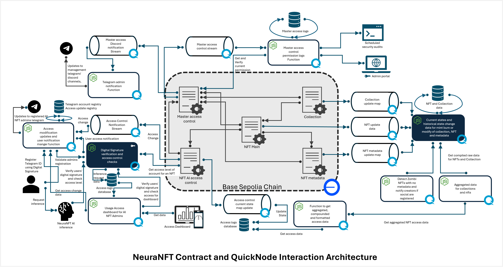
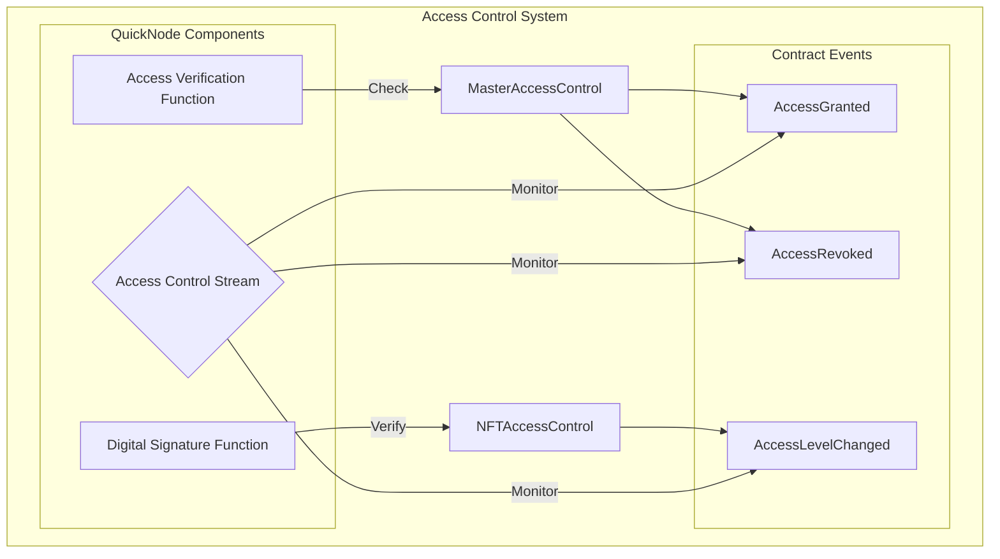
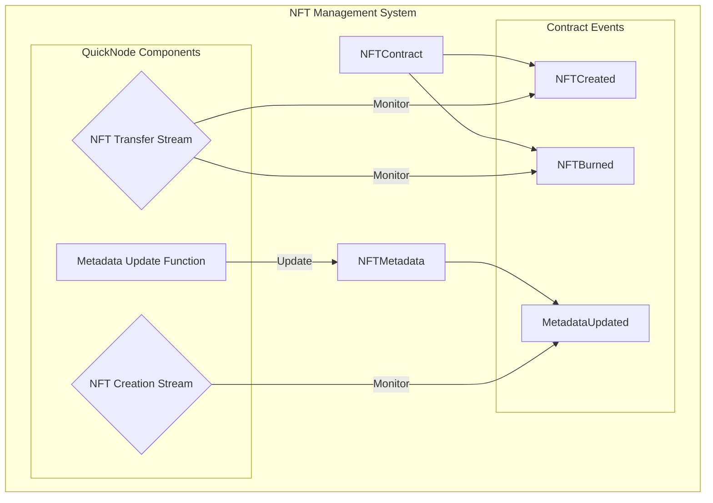
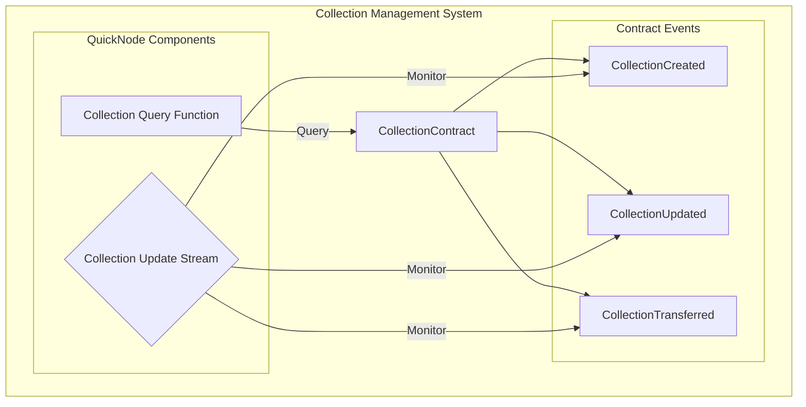
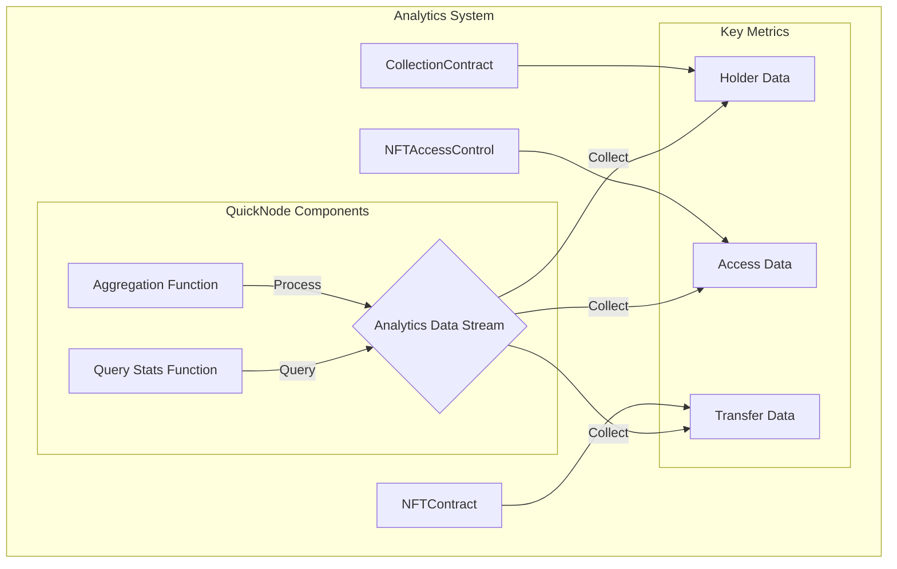

# NeuraNFT QuickNode Integration

## Overview
NeuraNFT is a decentralized platform for AI model and dataset tokenization, leveraging QuickNode's infrastructure for real-time updates, efficient data processing, and seamless blockchain interactions. Our architecture integrates smart contracts with QuickNode's streams and functions to create a robust, scalable system for managing AI NFTs.



The above diagram illustrates our current implementation, showcasing the interaction between different system components and QuickNode services.

## Architectural Flow

```mermaid
flowchart TD
    subgraph AdminAndDAO["1. Platform Administration & DAO"]
        direction TB
        subgraph AdminStreams["Admin QuickNode Streams"]
            MNS[Master access Discord notification stream]
            MCS[Master access control stream]
        end
        
        subgraph AdminFunctions["Admin QuickNode Functions"]
            TAN[Telegram admin notification Function]
            MAP[Master access control permission logs Function]
        end

        subgraph AdminComponents["Admin Components"]
            AP[Admin portal]
            SA[Security audits]
            MAL[(Master access logs DB)]
        end
    end

    subgraph AccessControl["2. Access Control & Authentication"]
        direction TB
        subgraph AuthStreams["Authentication Streams"]
            ANS[Access Control Notification Stream]
            UNS[User access notification]
        end
        
        subgraph AuthFunctions["Authentication Functions"]
            DSV[Digital Signature verification Function]
            ACV[Access control verification]
        end

        subgraph AccessComponents["Access Components"]
            MAC[[Master access control]]
            NAC[[NFT AI access control]]
            ALD[(Access logs database)]
        end
    end

    subgraph NFTSystem["3. NFT & Collection Management"]
        direction TB
        subgraph NFTStreams["NFT QuickNode Streams"]
            CUS[Collection update stream]
            NUS[NFT update stream]
            MUS[Metadata update stream]
        end
        
        subgraph NFTFunctions["NFT Management Functions"]
            CUM[Collection update manager]
            NUM[NFT update manager]
            MDM[Metadata manager]
        end

        subgraph NFTComponents["NFT Core Components"]
            CC[[Collection contract]]
            NC[[NFT Main contract]]
            MC[[NFT Metadata contract]]
            NFD[(NFT and Collection data)]
        end
    end

    subgraph Analytics["4. Dashboard & Analytics"]
        direction TB
        subgraph AnalyticsStreams["Analytics Streams"]
            ACS[Access control current state stream]
            SCS[State change stream]
        end
        
        subgraph AnalyticsFunctions["Analytics Functions"]
            AGF[Aggregated data Function]
            ZDF[Zombie NFT detection Function]
        end

        subgraph DashboardComponents["Dashboard Components"]
            UAD[Usage Access dashboard]
            ACD[Access Control dashboard]
            SAD[(State and analytics DB)]
        end
    end

    %% Cross-component interactions
    MNS --> TAN
    MCS --> MAP
    MAP --> MAL
    MAP --> AP

    ANS --> DSV
    UNS --> ACV
    DSV --> MAC
    ACV --> NAC
    ACV --> ALD

    CUS --> CUM
    NUS --> NUM
    MUS --> MDM
    CUM --> CC
    NUM --> NC
    MDM --> MC
    CC --> NFD
    NC --> NFD

    ACS --> AGF
    SCS --> ZDF
    AGF --> UAD
    ZDF --> ACD
    AGF --> SAD

    %% QuickNode specific interactions
    DSV -.->|Verify Signature| ACV
    CUM -.->|Update State| AGF
    NUM -.->|Track Changes| SCS
    MDM -.->|Monitor Updates| ZDF

    %% Cross-system data flow
    MAC -->|Access Rules| NAC
    NAC -->|Permissions| NC
    CC -->|Collection Data| NC
    NC -->|NFT State| MC
    ALD -->|Access History| SAD
    MAL -->|Admin Logs| SAD
```




Our architecture is divided into four main functional groups:
1. Platform Administration & DAO
2. Access Control & Authentication
3. NFT & Collection Management
4. Dashboard & Analytics

Each group utilizes QuickNode's streams and functions for real-time data processing and event handling.

## QuickNode Integration Benefits

### Comparison: Traditional Polling vs QuickNode Infrastructure

| Aspect | Traditional Polling System | QuickNode Integration | Advantage |
|--------|---------------------------|----------------------|------------|
| **Real-time Updates** | Periodic polling causing delays (5-30s) | Instant updates via Streams (ms) | 50x faster response time |
| **Server Load** | High (constant API calls) | Low (event-driven) | 70% reduction in server load |
| **Data Consistency** | Potential missed events | Guaranteed delivery | Enhanced reliability |
| **Scalability** | Limited by polling frequency | Highly scalable event system | Better resource utilization |
| **Cost Efficiency** | High (continuous queries) | Pay per actual usage | 40-60% cost reduction |
| **Network Traffic** | Heavy (repeated requests) | Lightweight (WebSocket) | 80% reduction in bandwidth |
| **Implementation** | Complex retry logic needed | Built-in reliability | Reduced development time |
| **State Management** | Manual sync required | Automatic sync via Streams | Improved data consistency |

### QuickNode Components in NeuraNFT

1. **QuickNode Streams**
   - Master Access Control Stream: Real-time permission updates
   - NFT State Change Stream: Instant NFT modifications
   - Collection Update Stream: Collection state management
   - Access Notification Stream: Real-time access control

2. **QuickNode Functions**
   - Digital Signature Verification
   - Access Control Management
   - Data Aggregation
   - Analytics Processing

### Key Benefits

1. **Enhanced Performance**
   - Reduced latency in NFT operations
   - Real-time access control updates
   - Efficient data synchronization

2. **Improved Security**
   - Instant access revocation
   - Real-time threat detection
   - Automated security audits

3. **Better User Experience**
   - Immediate transaction feedback
   - Real-time dashboard updates
   - Responsive access management

4. **Operational Efficiency**
   - Automated state management
   - Reduced infrastructure costs
   - Simplified development process

## Use Cases and Impact

1. **Access Control Management**
   - Traditional: 5-30 second delay in access updates
   - QuickNode: Instant access control changes (<100ms)

2. **NFT State Updates**
   - Traditional: Potential missed state changes
   - QuickNode: Guaranteed state consistency

3. **Analytics and Monitoring**
   - Traditional: Batch processing delays
   - QuickNode: Real-time analytics and alerts

4. **System Administration**
   - Traditional: Manual intervention often required
   - QuickNode: Automated event-driven administration

# NeuraNFT QuickNode Integration Details

## 1. Access Control Integration



### Implementation Details
Based on `MasterAccessControl.sol` and `NFTAccessControl.sol`:

1. **Event Monitoring**
   - AccessGranted: `event AccessGranted(address indexed contractAddress, address indexed caller)`
   - AccessRevoked: `event AccessRevoked(address indexed contractAddress, address indexed caller)`
   - AccessLevelChanged: `event AccessLevelChanged(address indexed user, uint256 indexed collectionId, uint256 indexed nftId, AccessLevel newAccessLevel)`

2. **Access Levels**
```solidity
enum AccessLevel {
    None,
    UseModel,
    Resale,
    CreateReplica,
    ViewAndDownload,
    EditData,
    AbsoluteOwnership
}
```

3. **QuickNode Function Integration**
- Digital signature verification for access requests
- Real-time access level verification
- Permission change notifications

## 2. NFT Management Integration



### Implementation Details
Based on `NFTContract.sol` and `NFTMetadata.sol`:

1. **NFT Creation and Management**
```solidity
struct NFTInfo {
    uint8 levelOfOwnership;
    string name;
    address creator;
    uint256 creationDate;
    address owner;
}
```

2. **Metadata Structure**
```solidity
struct Metadata {
    string image;
    string baseModel;
    string data;
    string rag;
    string fineTuneData;
    string description;
}
```

3. **QuickNode Integration Points**
- Real-time NFT creation monitoring
- Metadata update streams
- Transfer and ownership tracking

## 3. Collection Management Integration



### Implementation Details
Based on `CollectionContract.sol`:

1. **Collection Structure**
```solidity
struct CollectionMetadata {
    string name;
    uint256 contextWindow;
    string baseModel;
    string image;
    string description;
    address creator;
    uint256 dateCreated;
    address owner;
}
```

2. **Key Functions Monitored**
- Collection creation and updates
- Ownership transfers
- NFT counting and holder tracking

3. **QuickNode Integration Points**
- Collection state change monitoring
- Real-time metadata updates
- Holder statistics tracking

## 4. Analytics and Dashboard Integration



### Implementation Details
Based on actual contract implementations:

1. **Analytics Data Points**
- Number of holders: `numberOfHolders(uint256 _collectionId)`
- Collection statistics: `getCollectionNFTCount(uint256 _collectionId)`
- Access patterns: `getAllAccessForUser(address _user)`

2. **Dashboard Metrics**
```solidity
// Access Entry Structure
struct AccessEntry {
    uint256 collectionId;
    uint256 nftId;
    AccessLevel accessLevel;
}
```

3. **QuickNode Integration Points**
- Real-time analytics data collection
- Access pattern analysis
- Holder statistics aggregation

Key Features Present in Current Implementation:
- Real-time access tracking
- Collection statistics
- Holder analytics
- Transfer monitoring
- Access level changes
- Metadata updates

Each of these integrations leverages QuickNode's infrastructure to provide:
- Real-time event monitoring
- Efficient data aggregation
- Scalable query processing
- Reliable state tracking


## Technical Implementation

1. **Stream Integration**
```javascript
// QuickNode Stream Configuration
const stream = new QuickNode.Stream({
    filters: [{
        status: 'confirmed',
        contractAddress: 'NFT_CONTRACT_ADDRESS'
    }]
});

stream.on('data', (data) => {
    // Real-time event handling
});
```

2. **Function Implementation**
```javascript
// QuickNode Function Example
export async function verifyAccess(request) {
    const { signature, nftId, userId } = request;
    // Perform verification
    return { verified: true, accessLevel: 'READ' };
}
```

## Future Enhancements

1. **Advanced Analytics**
   - ML-powered usage patterns
   - Predictive access management

2. **Enhanced Automation**
   - Smart contract automation
   - Automated compliance checks

3. **Expanded Integration**
   - Cross-chain functionality
   - Enhanced data aggregation


# Integration Screenshots


