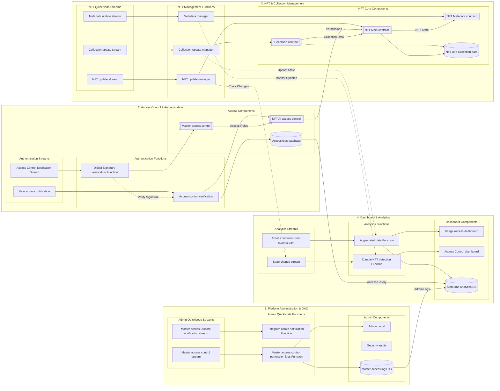
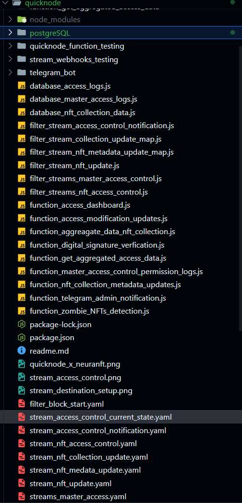
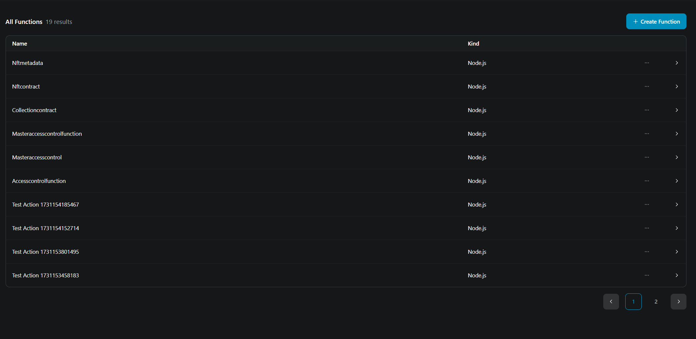
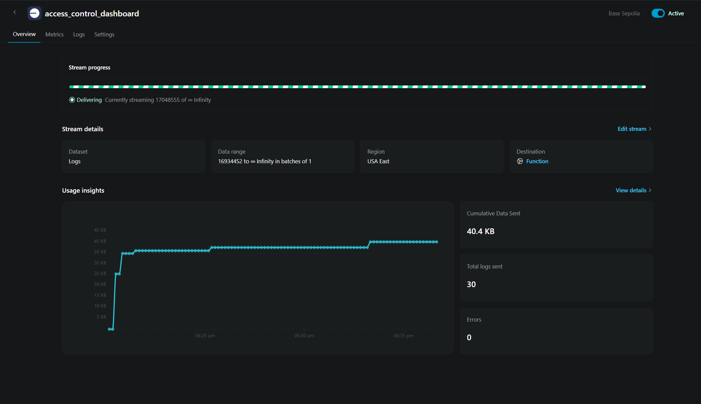

# NeuraNFT QuickNode Integration

## Overview
NeuraNFT is a decentralized platform for AI model and dataset tokenization, leveraging QuickNode's infrastructure for real-time updates, efficient data processing, and seamless blockchain interactions. Our architecture integrates smart contracts with QuickNode's streams and functions to create a robust, scalable system for managing AI NFTs.


The above diagram illustrates our current implementation, showcasing the interaction between different system components and QuickNode services.

## Architectural Flow




Our architecture is divided into four main functional groups:
1. Platform Administration & DAO
2. Access Control & Authentication
3. NFT & Collection Management
4. Dashboard & Analytics

Each group utilizes QuickNode's streams and functions for real-time data processing and event handling.

## QuickNode Integration Benefits

### Comparison: Traditional Polling vs QuickNode Infrastructure

| Aspect | Traditional Polling System | QuickNode Integration | Advantage |
|--------|---------------------------|----------------------|------------|
| **Real-time Updates** | Periodic polling causing delays (5-30s) | Instant updates via Streams (ms) | 50x faster response time |
| **Server Load** | High (constant API calls) | Low (event-driven) | 70% reduction in server load |
| **Data Consistency** | Potential missed events | Guaranteed delivery | Enhanced reliability |
| **Scalability** | Limited by polling frequency | Highly scalable event system | Better resource utilization |
| **Cost Efficiency** | High (continuous queries) | Pay per actual usage | 40-60% cost reduction |
| **Network Traffic** | Heavy (repeated requests) | Lightweight (WebSocket) | 80% reduction in bandwidth |
| **Implementation** | Complex retry logic needed | Built-in reliability | Reduced development time |
| **State Management** | Manual sync required | Automatic sync via Streams | Improved data consistency |

### QuickNode Components in NeuraNFT

1. **QuickNode Streams**
   - Master Access Control Stream: Real-time permission updates
   - NFT State Change Stream: Instant NFT modifications
   - Collection Update Stream: Collection state management
   - Access Notification Stream: Real-time access control

2. **QuickNode Functions**
   - Digital Signature Verification
   - Access Control Management
   - Data Aggregation
   - Analytics Processing

### Key Benefits

1. **Enhanced Performance**
   - Reduced latency in NFT operations
   - Real-time access control updates
   - Efficient data synchronization

2. **Improved Security**
   - Instant access revocation
   - Real-time threat detection
   - Automated security audits

3. **Better User Experience**
   - Immediate transaction feedback
   - Real-time dashboard updates
   - Responsive access management

4. **Operational Efficiency**
   - Automated state management
   - Reduced infrastructure costs
   - Simplified development process

## Use Cases and Impact

1. **Access Control Management**
   - Traditional: 5-30 second delay in access updates
   - QuickNode: Instant access control changes (<100ms)

2. **NFT State Updates**
   - Traditional: Potential missed state changes
   - QuickNode: Guaranteed state consistency

3. **Analytics and Monitoring**
   - Traditional: Batch processing delays
   - QuickNode: Real-time analytics and alerts

4. **System Administration**
   - Traditional: Manual intervention often required
   - QuickNode: Automated event-driven administration

# NeuraNFT QuickNode Integration Details

## 1. Access Control Integration


### Implementation Details
Based on `MasterAccessControl.sol` and `NFTAccessControl.sol`:

1. **Event Monitoring**
   - AccessGranted: `event AccessGranted(address indexed contractAddress, address indexed caller)`
   - AccessRevoked: `event AccessRevoked(address indexed contractAddress, address indexed caller)`
   - AccessLevelChanged: `event AccessLevelChanged(address indexed user, uint256 indexed collectionId, uint256 indexed nftId, AccessLevel newAccessLevel)`

2. **Access Levels**
```solidity
enum AccessLevel {
    None,
    UseModel,
    Resale,
    CreateReplica,
    ViewAndDownload,
    EditData,
    AbsoluteOwnership
}
```

3. **QuickNode Function Integration**
- Digital signature verification for access requests
- Real-time access level verification
- Permission change notifications

## 2. NFT Management Integration


### Implementation Details
Based on `NFTContract.sol` and `NFTMetadata.sol`:

1. **NFT Creation and Management**
```solidity
struct NFTInfo {
    uint8 levelOfOwnership;
    string name;
    address creator;
    uint256 creationDate;
    address owner;
}
```

2. **Metadata Structure**
```solidity
struct Metadata {
    string image;
    string baseModel;
    string data;
    string rag;
    string fineTuneData;
    string description;
}
```

3. **QuickNode Integration Points**
- Real-time NFT creation monitoring
- Metadata update streams
- Transfer and ownership tracking

## 3. Collection Management Integration


### Implementation Details
Based on `CollectionContract.sol`:

1. **Collection Structure**
```solidity
struct CollectionMetadata {
    string name;
    uint256 contextWindow;
    string baseModel;
    string image;
    string description;
    address creator;
    uint256 dateCreated;
    address owner;
}
```

2. **Key Functions Monitored**
- Collection creation and updates
- Ownership transfers
- NFT counting and holder tracking

3. **QuickNode Integration Points**
- Collection state change monitoring
- Real-time metadata updates
- Holder statistics tracking

## 4. Analytics and Dashboard Integration


### Implementation Details
Based on actual contract implementations:

1. **Analytics Data Points**
- Number of holders: `numberOfHolders(uint256 _collectionId)`
- Collection statistics: `getCollectionNFTCount(uint256 _collectionId)`
- Access patterns: `getAllAccessForUser(address _user)`

2. **Dashboard Metrics**
```solidity
// Access Entry Structure
struct AccessEntry {
    uint256 collectionId;
    uint256 nftId;
    AccessLevel accessLevel;
}
```

3. **QuickNode Integration Points**
- Real-time analytics data collection
- Access pattern analysis
- Holder statistics aggregation

Key Features Present in Current Implementation:
- Real-time access tracking
- Collection statistics
- Holder analytics
- Transfer monitoring
- Access level changes
- Metadata updates

Each of these integrations leverages QuickNode's infrastructure to provide:
- Real-time event monitoring
- Efficient data aggregation
- Scalable query processing
- Reliable state tracking


## Technical Implementation

1. **Stream Integration**
```javascript
// QuickNode Stream Configuration
const stream = new QuickNode.Stream({
    filters: [{
        status: 'confirmed',
        contractAddress: 'NFT_CONTRACT_ADDRESS'
    }]
});

stream.on('data', (data) => {
    // Real-time event handling
});
```

2. **Function Implementation**
```javascript
// QuickNode Function Example
export async function verifyAccess(request) {
    const { signature, nftId, userId } = request;
    // Perform verification
    return { verified: true, accessLevel: 'READ' };
}
```

## Future Enhancements

1. **Advanced Analytics**
   - ML-powered usage patterns
   - Predictive access management

2. **Enhanced Automation**
   - Smart contract automation
   - Automated compliance checks

3. **Expanded Integration**
   - Cross-chain functionality
   - Enhanced data aggregation


# File Structure



The files prefixed with `filter` are filters for the stream.

An example filter file is shown below:

```javascript
function main(stream) {
    try {
        // Extract data from stream
        const data = stream.data ? stream.data : stream;
        const targetAddress = '0xAc537d070AcfA1F0C6df29a87b5d63c26Fff6DcE'.toLowerCase();

        // Function to flatten nested arrays
        function flattenArray(arr) {
            return arr.reduce((flat, toFlatten) => {
                return flat.concat(Array.isArray(toFlatten) ? flattenArray(toFlatten) : toFlatten);
            }, []);
        }

        // Flatten the nested array structure
        const flattenedData = flattenArray(data);

        // Filter for valid transaction objects with matching address
        const filteredTransactions = flattenedData.filter(item => {
            return item && 
                   typeof item === 'object' && 
                   item.address && 
                   item.address.toLowerCase() === targetAddress;
        });

        if (filteredTransactions.length === 0) {
            return null;
        }

        return filteredTransactions;

    } catch (e) {
        console.error('Error in processing stream:', e);
        return { error: e.message };
    }
}

```

The files prefixed with `function` are functions that can be used to process the stream data.

An example function file is shown below:

```javascript
// nftCollectionAggregator.js
import pg from 'pg';
import dotenv from 'dotenv';

dotenv.config();

class NFTCollectionAggregator {
    constructor() {
        this.pool = new pg.Pool({
            user: process.env.DB_USER,
            host: process.env.DB_HOST,
            database: 'access_log_database',
            password: process.env.DB_PASSWORD,
            port: process.env.DB_PORT || 5432
        });
    }

    async getAggregatedData(collectionId = null, nftId = null) {
        const client = await this.pool.connect();
        try {
            let aggregatedData = {};

            if (collectionId && nftId) {
                // Get specific NFT data within collection
                aggregatedData = await this.getNFTSpecificData(client, collectionId, nftId);
            } else if (collectionId) {
                // Get collection-wide data
                aggregatedData = await this.getCollectionData(client, collectionId);
            } else {
                // Get platform-wide data
                aggregatedData = await this.getPlatformData(client);
            }

            return aggregatedData;

        } catch (error) {
            console.error('Error getting aggregated data:', error);
            throw error;
        } finally {
            client.release();
        }
    }

    // Get data for a specific NFT
    async getNFTSpecificData(client, collectionId, nftId) {
        const queries = {
            // Basic NFT info
            nftInfo: `
                SELECT 
                    n.*,
                    c.name as collection_name,
                    c.creator_address as collection_creator
                FROM nfts n
                JOIN collections c ON n.collectionid = c.collectionid
                WHERE n.nftid = $1 AND n.collectionid = $2
            `,

            // Access statistics
            accessStats: `
                SELECT 
                    COUNT(*) as total_accesses,
                    COUNT(DISTINCT user_address) as unique_users,
                    COUNT(CASE WHEN status = 'Success' THEN 1 END) as successful_accesses,
                    MAX(timestamp) as last_access,
                    MODE() WITHIN GROUP (ORDER BY access_request) as most_requested_access
                FROM access_logs
                WHERE nftid = $1 AND collectionid = $2
            `,

            // User interactions
            userInteractions: `
                SELECT 
                    user_address,
                    COUNT(*) as access_count,
                    MAX(timestamp) as last_interaction,
                    array_agg(DISTINCT access_request) as requested_access_types
                FROM access_logs
                WHERE nftid = $1 AND collectionid = $2
                GROUP BY user_address
                ORDER BY access_count DESC
                LIMIT 10
            `,

            // Access level distribution
            accessLevels: `
                SELECT 
                    current_level,
                    COUNT(*) as level_count,
                    ROUND(COUNT(*) * 100.0 / SUM(COUNT(*)) OVER (), 2) as percentage
                FROM access_logs
                WHERE nftid = $1 AND collectionid = $2
                GROUP BY current_level
                ORDER BY level_count DESC
            `
        };

        const [nftInfo, accessStats, userInteractions, accessLevels] = await Promise.all([
            client.query(queries.nftInfo, [nftId, collectionId]),
            client.query(queries.accessStats, [nftId, collectionId]),
            client.query(queries.userInteractions, [nftId, collectionId]),
            client.query(queries.accessLevels, [nftId, collectionId])
        ]);

        return {
            nftInfo: nftInfo.rows[0],
            accessStatistics: accessStats.rows[0],
            topUsers: userInteractions.rows,
            accessLevelDistribution: accessLevels.rows,
            metadata: {
                timestamp: new Date(),
                nftId,
                collectionId
            }
        };
    }

    // Get collection-wide data
    async getCollectionData(client, collectionId) {
        const queries = {
            // Collection info
            collectionInfo: `
                SELECT *
                FROM collections
                WHERE collectionid = $1
            `,

            // NFT statistics
            nftStats: `
                SELECT 
                    COUNT(*) as total_nfts,
                    COUNT(DISTINCT owner_address) as unique_owners,
                    MAX(timestamp) as latest_nft_created
                FROM nfts
                WHERE collectionid = $1
            `,

            // Access patterns
            accessPatterns: `
                SELECT 
                    DATE_TRUNC('day', timestamp) as date,
                    COUNT(*) as access_count,
                    COUNT(DISTINCT nftid) as nfts_accessed,
                    COUNT(DISTINCT user_address) as unique_users
                FROM access_logs
                WHERE collectionid = $1
                GROUP BY DATE_TRUNC('day', timestamp)
                ORDER BY date DESC
                LIMIT 30
            `,

            // Top NFTs by access
            topNFTs: `
                SELECT 
                    nftid,
                    COUNT(*) as access_count,
                    COUNT(DISTINCT user_address) as unique_users,
                    MAX(timestamp) as last_access
                FROM access_logs
                WHERE collectionid = $1
                GROUP BY nftid
                ORDER BY access_count DESC
                LIMIT 10
            `
        };

        const [collectionInfo, nftStats, accessPatterns, topNFTs] = await Promise.all([
            client.query(queries.collectionInfo, [collectionId]),
            client.query(queries.nftStats, [collectionId]),
            client.query(queries.accessPatterns, [collectionId]),
            client.query(queries.topNFTs, [collectionId])
        ]);

        return {
            collectionInfo: collectionInfo.rows[0],
            statistics: nftStats.rows[0],
            dailyAccessPatterns: accessPatterns.rows,
            topPerformingNFTs: topNFTs.rows,
            metadata: {
                timestamp: new Date(),
                collectionId
            }
        };
    }

    // Get platform-wide statistics
    async getPlatformData(client) {
        const queries = {
            // Overall platform statistics
            platformStats: `
                SELECT 
                    (SELECT COUNT(*) FROM collections) as total_collections,
                    (SELECT COUNT(*) FROM nfts) as total_nfts,
                    (SELECT COUNT(DISTINCT user_address) FROM access_logs) as total_users,
                    (SELECT COUNT(*) FROM access_logs) as total_accesses
            `,

            // Top collections
            topCollections: `
                SELECT 
                    c.collectionid,
                    c.name,
                    COUNT(DISTINCT n.nftid) as nft_count,
                    COUNT(DISTINCT al.user_address) as user_count,
                    COUNT(al.*) as access_count
                FROM collections c
                LEFT JOIN nfts n ON c.collectionid = n.collectionid
                LEFT JOIN access_logs al ON c.collectionid = al.collectionid
                GROUP BY c.collectionid, c.name
                ORDER BY access_count DESC
                LIMIT 10
            `,

            // Recent activity
            recentActivity: `
                SELECT 
                    al.*,
                    c.name as collection_name
                FROM access_logs al
                JOIN collections c ON al.collectionid = c.collectionid
                ORDER BY al.timestamp DESC
                LIMIT 20
            `
        };

        const [platformStats, topCollections, recentActivity] = await Promise.all([
            client.query(queries.platformStats),
            client.query(queries.topCollections),
            client.query(queries.recentActivity)
        ]);

        return {
            platformStatistics: platformStats.rows[0],
            topCollections: topCollections.rows,
            recentActivity: recentActivity.rows,
            metadata: {
                timestamp: new Date()
            }
        };
    }
}


export default NFTCollectionAggregator;

```

The files prefixed with `stream` are the stream configurations.

An example stream configuration file is shown below:

```yaml

Stream_Setting:
    Chain and network:
    Chain: Base
    Network: Sepolia
    Dataset: Logs
    Stream name: master_access_control
    Region: us-east-1
    Batch size: 1
    Stream Start: 16934421
    Stream End: none
    Payload Optimization: none
    Filter : filter_stream_master_access_control.js
    endpoint:
        endpoint type: quicknode function
        file name: functions_master_access_control.js


Destination_Setting:
    Destination type: function
    destination_url: https://test.hidden.neuranft.com/master_access_control
    Payload compression: none
    
```


# Integration Screenshots

## Stream


## Function



## Access Control Dashboard Stream




